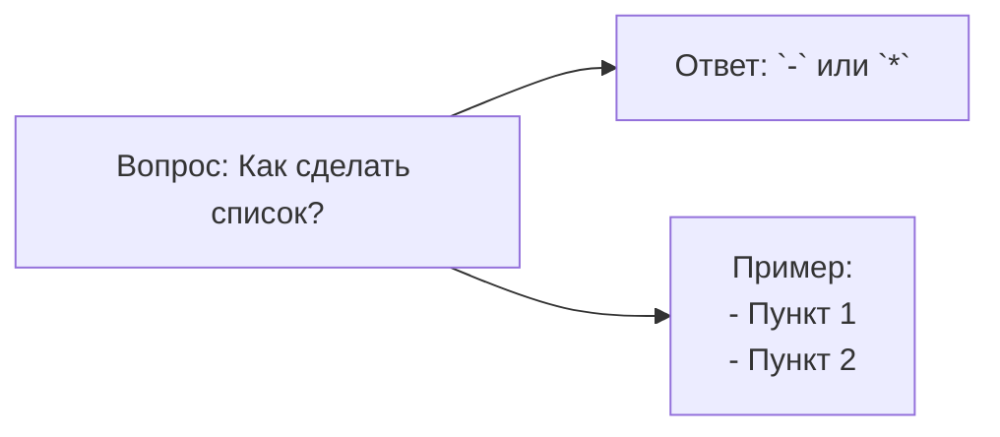
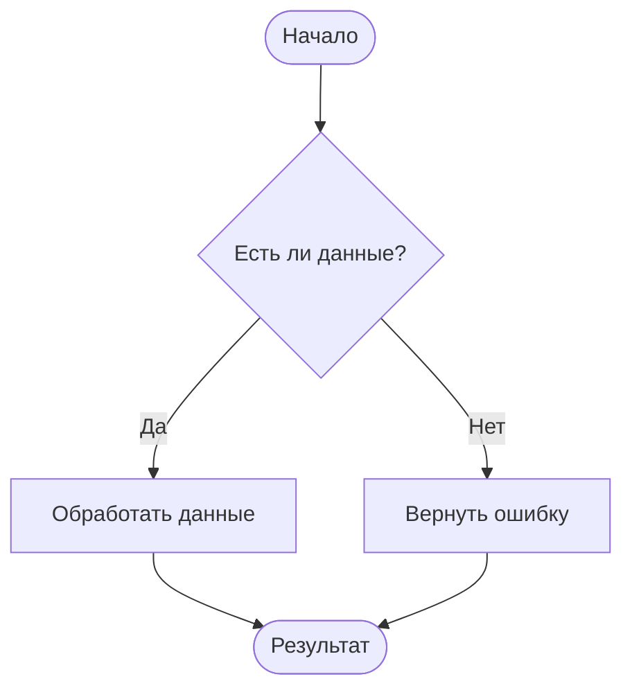
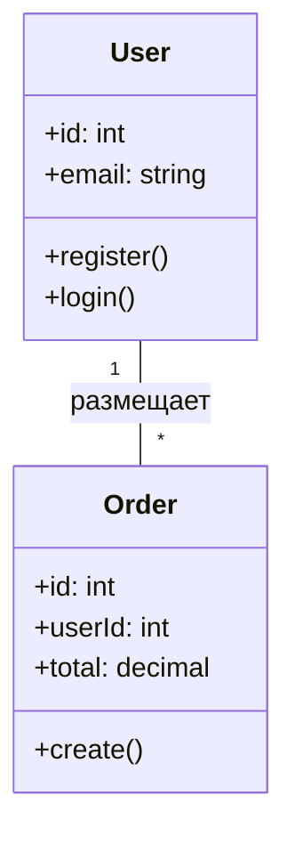
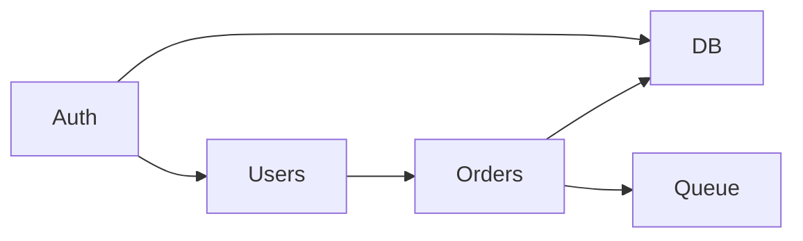
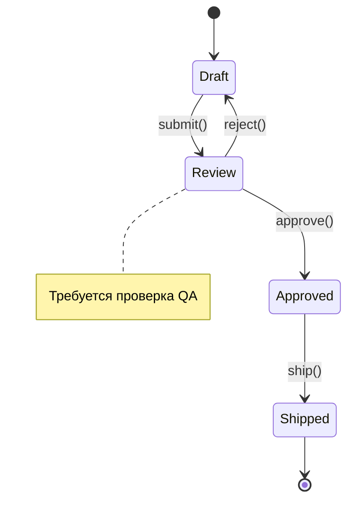

## Mermaid
Mermaid - это сильно упрощённый и далекий аналог
**UML** - специальный язык описания блок-схем, графиков и диаграмм с их визуализацией.

### Блок схемы

#### базовая структура 1

flowchart LR
    A[Вопрос: Как сдеать список?] --> B["Ответ: - `-` или `*`"]
    A --> C["Пример: \n - Пункт 1 \n"]

* `flowchart` - блок-схема
* `LR` - направление вправо
* `A[],B[],C[]` - прямоугольник
* `-->` - стрелка связи

#### базовая структура 2

#### полный ситаксис блок-схем

### Диаграмма последовательности


### Диаграмма класса


### Диаграмма Ганта
```mermaid
gantt
    title План разработки фичи «Личный кабинет»
    dateFormat  YYYY-MM-DD
    excludesWeekdays 0,6

    section Разработка
        Backend API:       done, 2025-10-01, 2025-10-05
        Frontend формы:    active, 2025-10-06, 2025-10-12

    section Тестирование
        Unit-тесты:        2025-10-13, 2025-10-14
        E2E тесты:         2025-10-15, 2025-10-16

```

### Граф зависимостей

### Диаграмма состояний

### Юзер-джайрни

### Кастомизация стилей
```mermaid
%%{init: {'theme':'default','themeVariables':{'primaryColor':'#2E7D32','edgeLabelBackground':'#FFFFFF'}}}%%

```

### круговая диаграмма
